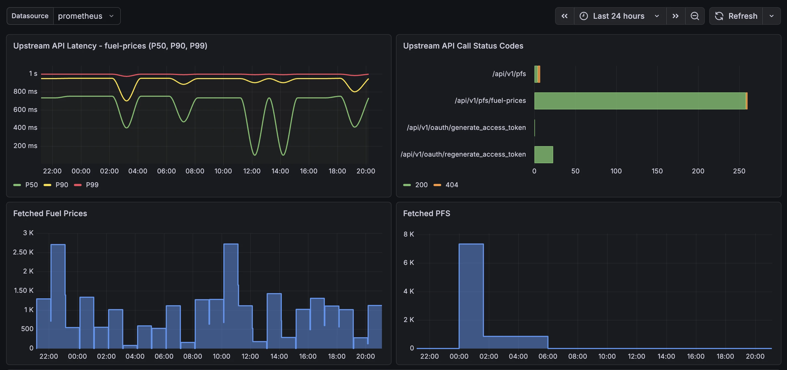

# fuel-prices-api

Wraps GOV.UKs petrol prices API to allow historical querying and fast geo-lookup by bounding box

## Grafana Dashboard

Import the [grafana_dashboard.json](./grafana-dashboard.json) and set prometheus as the data source:



## Useful queries

```sql
SELECT node_id, fuel_type, MAX(price_last_updated), COUNT(*)
FROM fuel_prices
GROUP BY node_id, fuel_type
HAVING COUNT(*) > 1;
```

## References

- https://www.developer.fuel-finder.service.gov.uk/public-api
